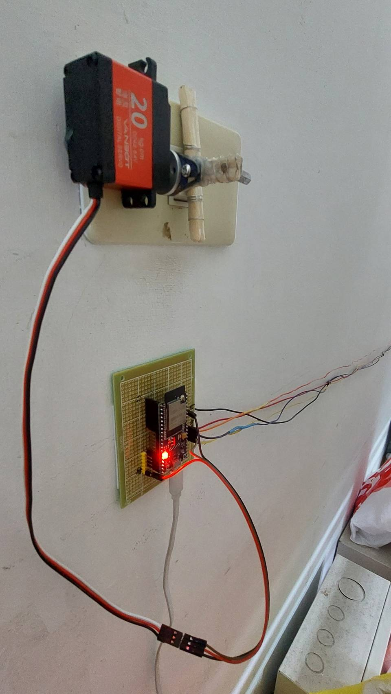
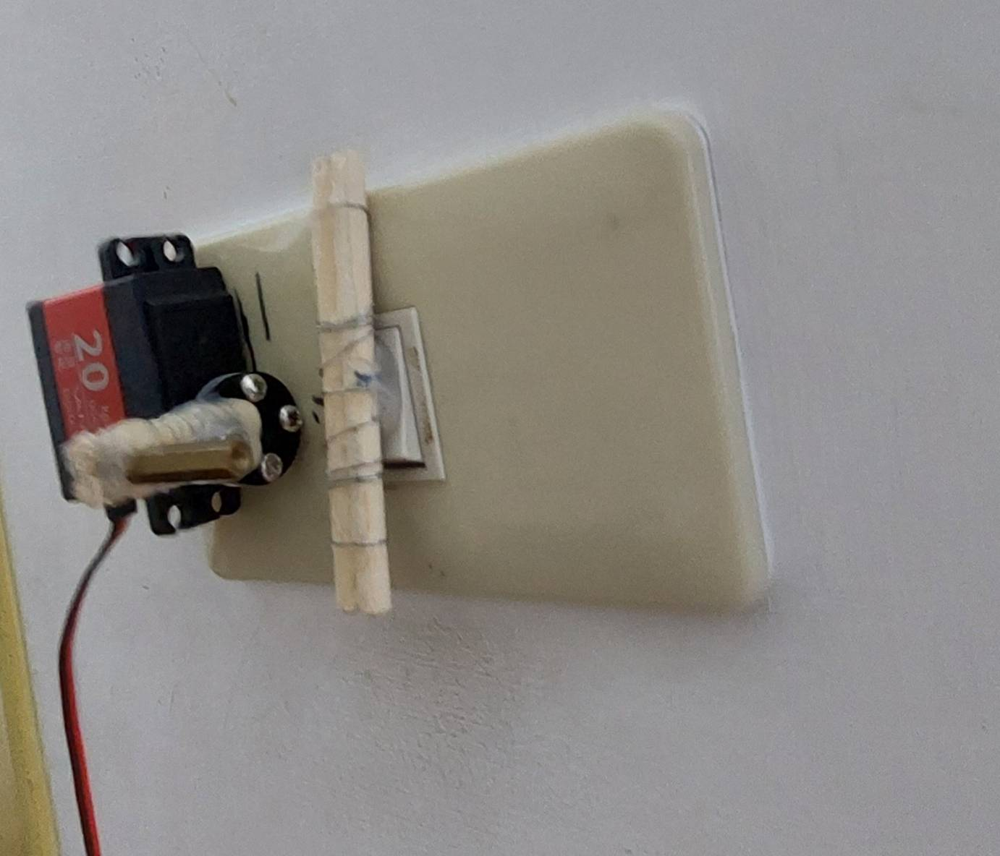
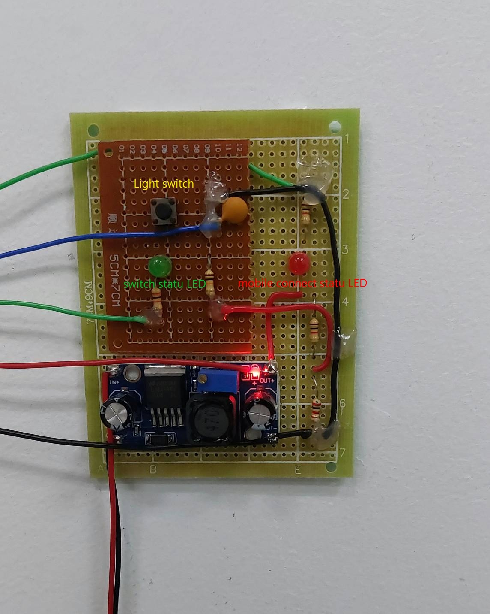

# servo_switch_control

## 📸 開關照片





## wifi 控制指令
###  on
  0x02 0x00 0xF1
###  off
  0x02 0x00 0xF1
  
| 名稱     | 類別  | 價格 |
|----------|------|------|
| 蘋果     | 水果  | $10  |
| 牛奶     | 飲料  | $20  |


## 專案下載
```sh
git clone https://github.com/fire200210/servo_switch_control.git
